# Typesense Dashboard

A dashboard to manage self hosted or local [Typesense](https://typesense.org/) instances.

Reference the [Typesense docs](https://typesense.org/docs/guide/install-typesense.html) to set up a new cluster.

[View with demo data](https://scarlson1.github.io/typesense-dashboard/#/auth?node=163.192.220.255.nip.io&port=443&protocol=https&apiKey=q0DAf2GWCdw0LPCzM72UytDVh719h4Tk&env=development)

If the link is not prefilling login creds, use the following:

- dashboard: [https://scarlson1.github.io/typesense-dashboard](https://scarlson1.github.io/typesense-dashboard/#/auth)
- host: 163.192.220.255.nip.io
- protocol: https
- port: 443
- api key: q0DAf2GWCdw0LPCzM72UytDVh719h4Tk

## Usage

#### Prerequisites

- running instance of typesense ([docs](https://typesense.org/docs/guide/install-typesense.html#option-1-typesense-cloud))

### Web

Use https://scarlson1.github.io/typesense-dashboard/ or clone the repository and run it locally. (If using github pages option, Typesense config must be configured with TLS or you'll get "ERR_NETWORK Network Error").

- [Typesense Docs](https://typesense.org/docs/29.0/api/server-configuration.html#ssl-https)
- Self-signed certificate references: [video](https://www.youtube.com/watch?v=sR4_YISXNZE) / [article](https://deliciousbrains.com/ssl-certificate-authority-for-local-https-development/) / [mkcert](https://github.com/FiloSottile/mkcert)

If your typesense instance is running locally, use a service such as [ngrok](https://ngrok.com/) or [tailscale](https://tailscale.com/) to add TLS if connecting to [github pages](https://scarlson1.github.io/typesense-dashboard/). For example:

```bash
$ ngrok http https://localhost:443
  # OR use ngrok's docker image:
$ docker run -it -e NGROK_AUTHTOKEN=[YOUR_NGROK_TOKEN] ngrok/ngrok:latest http host.docker.internal:443
```

Then use the address displayed in your console under "Forwarding" as the node when connecting your cluster (ex: f4ab4aad2e7b.ngrok-free.app). [Ngrok docs](https://ngrok.com/docs/using-ngrok-with/docker/)

If using the Github pages option, pass the `--enable-cors` flag in typesense command.

Use an admin key to authenticate. Cluster credentials are stored in session storage and will be removed when the window is closed.

### Docker

Download the repo and run in Docker Desktop:

```bash
$ git clone git@github.com:scarlson1/typesense-dashboard.git
$ docker build -t typesense-dashboard .
$ docker run -d -p 8108:8108 typesense-dashboard
```

From Docker Desktop:

```bash
$ docker pull spencercarlson/typesense-dashboard
$ docker run -d -p 8108:8108 spencercarlson/typesense-dashboard
```

From Github Registry:

```bash
$ docker run -d -p 443:443 docker pull ghcr.io/scarlson1/typesense-dashboard:latest
```

To enable geosearch, pass a mapbox key as an environment variable (i.e. docker run [...] -e VITE_MAPBOX_TOKEN="your_mapbox_token")

<!-- To use the latest pre-built image:

```bash
docker pull spencercarlson/typesense-dashboard
# or
docker run -d -p 443:443 spencercarlson/typesense-dashboard
```

To use the latest pre-built docker image:
```bash
docker run -d -p 443:443 ghcr.io/scarlson1/typesense-dashboard:latest
```

```bash
docker run -d -p 80:80 ghcr.io/scarlson1/typesense-dashboard:latest
```

If you have trouble connecting, trying ngrok.
option 1) ngrok http https://localhost:443
option 2) https://ngrok.com/docs/using-ngrok-with/docker/
-->

<!-- ## Limitations/Issues

TODO -->

## TODO

- Tests
- [Filter operators](https://typesense.org/docs/guide/tips-for-filtering.html#available-operators)
- [Boolean operators](https://typesense.org/docs/guide/tips-for-filtering.html#boolean-operations)
- [Geo operators](https://typesense.org/docs/guide/tips-for-filtering.html#filtering-geopoints)
- [Geosearch filter & sort](https://typesense.org/docs/29.0/api/geosearch.html#searching-within-a-radius)
- Delete documents by query
- Export documents
- Fix multi-cluster auth (currently overwriting existing)
- save collection preset preferences in local storage

## Screenshots

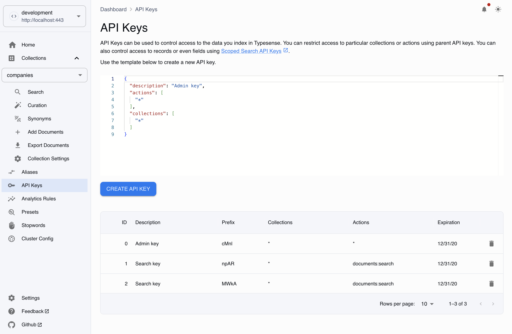

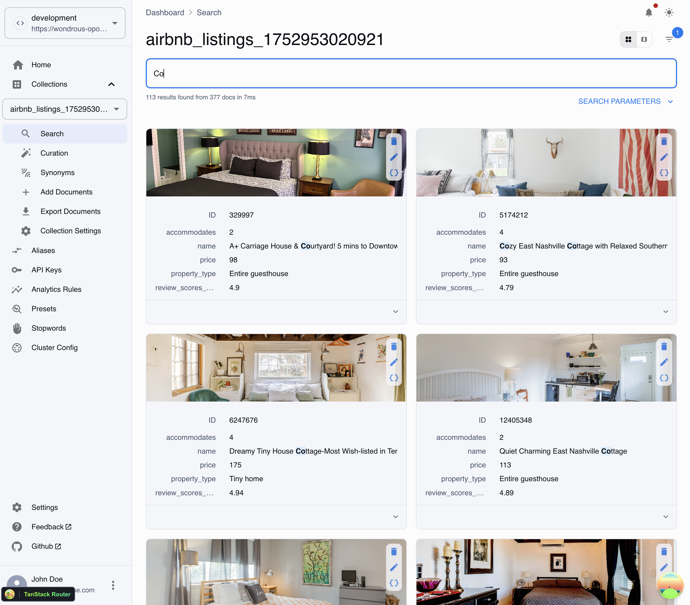

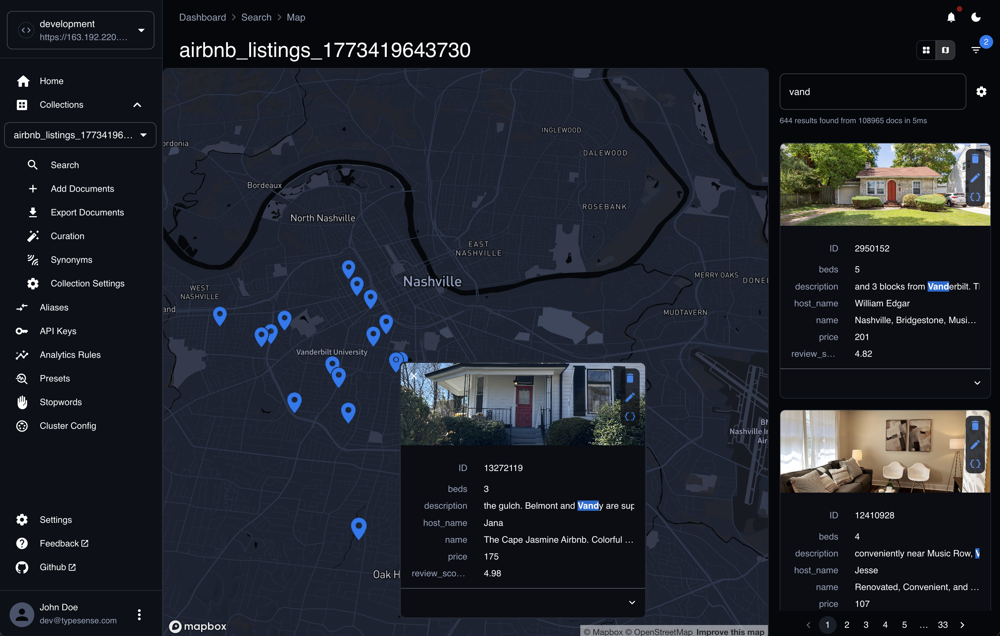

<!-- 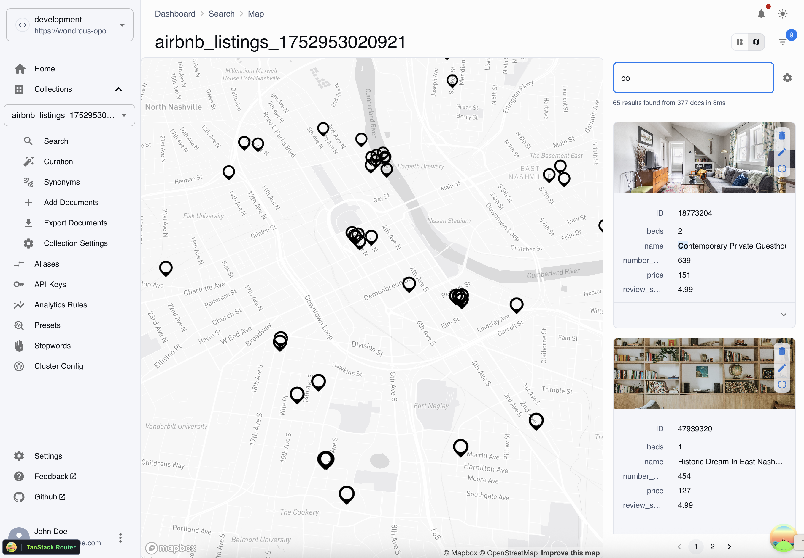 -->

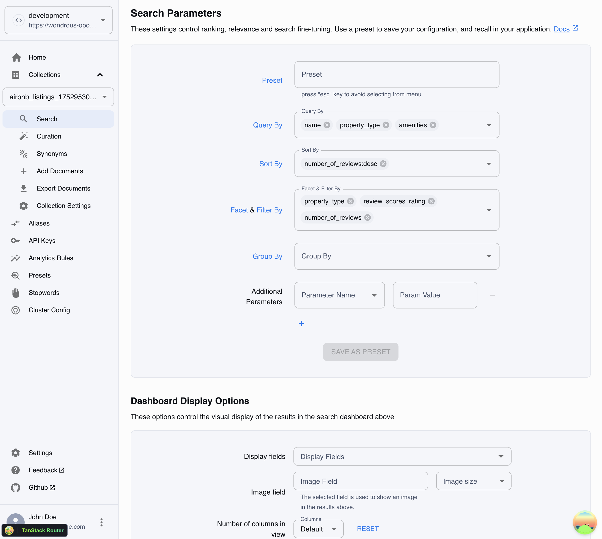

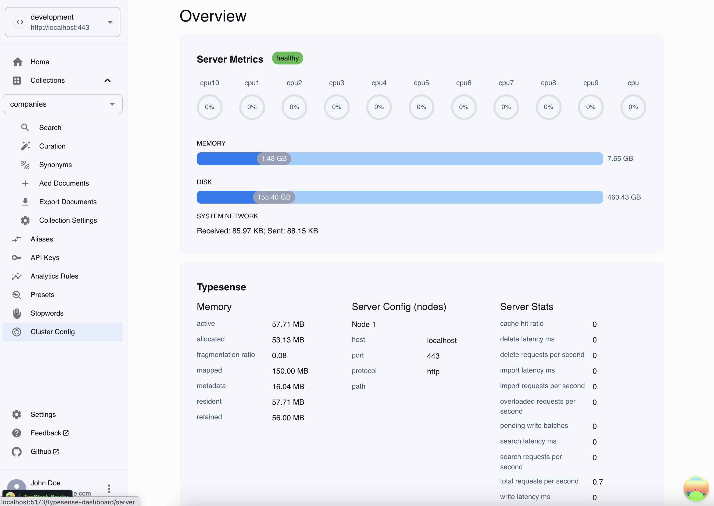

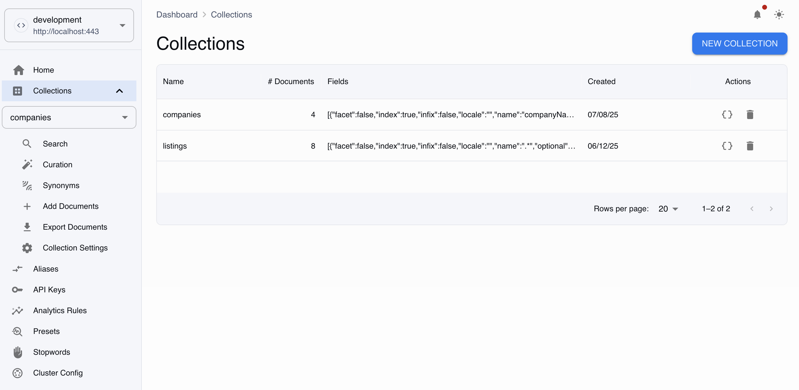

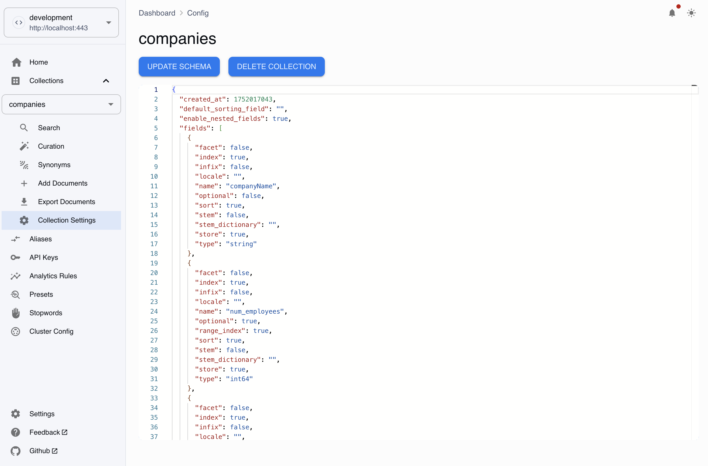

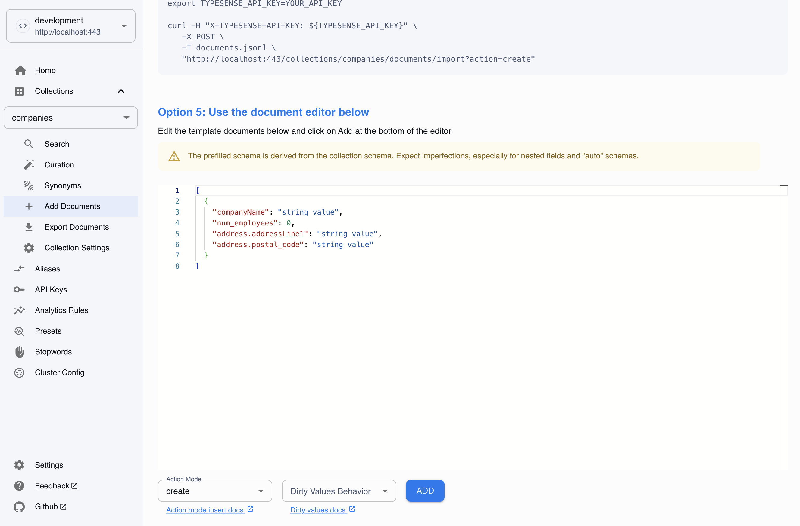

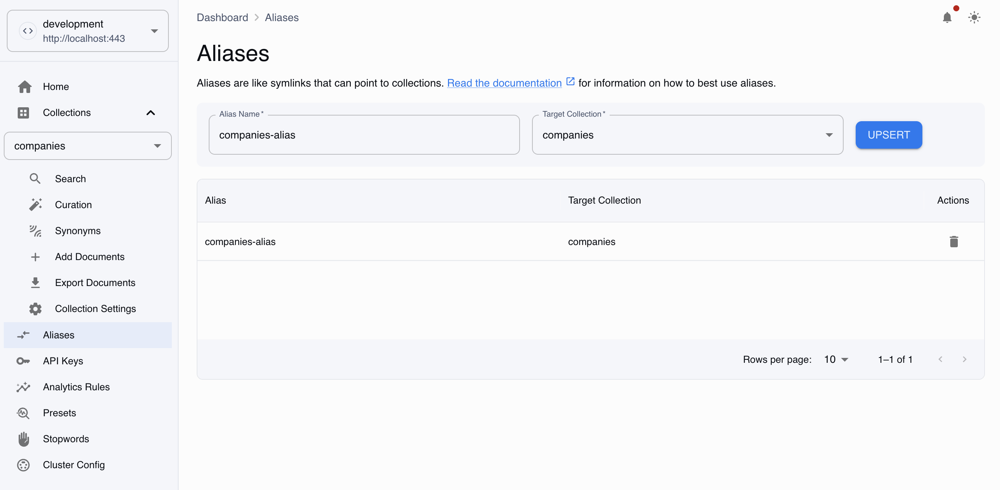

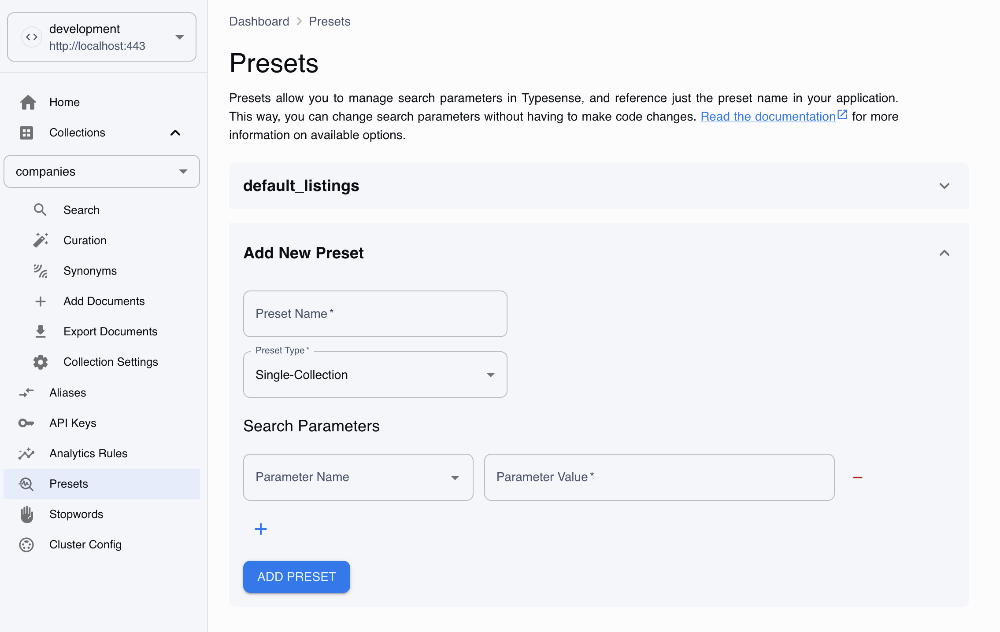

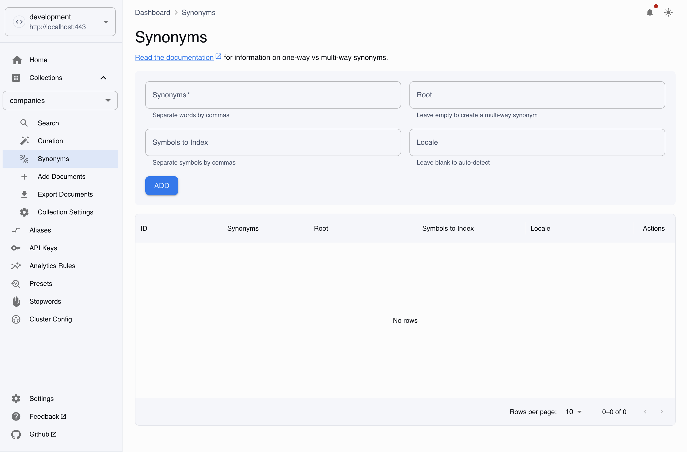

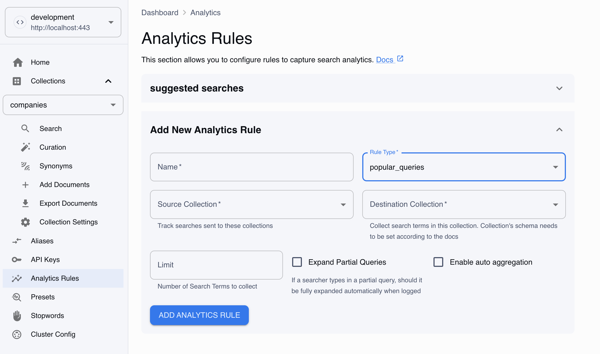

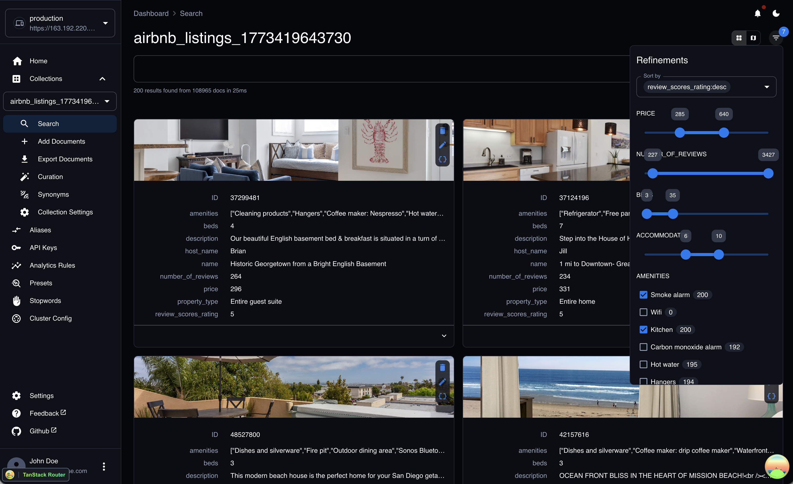

# Alternatives

- [Typesense Cloud](https://cloud.typesense.org/) (paid)
- bfritscher/typesense-dashboard [github](https://github.com/bfritscher/typesense-dashboard/tree/main) (vue)
- amartya-dev/typesense-dashboard [github](https://github.com/amartya-dev/typesense-dashboard) (typescript)

# Development

## Run locally

#### Install dependencies

```bash
pnpm install
```

#### Start the dashboard

```bash
pnpm dev
```

## Docker Compose

Update the volume paths in `compose.yml` or update `TYPESENSE_CERTS_DIR` and `TYPESENSE_DATA_PATH` environment variable in `.env.development`

```yml
volumes:
  - [path_to_typesense_data]:/data
  - [path_to_your_certs_directory]:/etc/ssl/certs
```

```bash
docker compose up -d
```

## VM to host demo Typesense instance

### 1. Create the VM

```bash
cd terraform
# Step 1 - create reserved IP and instance, no attachment
terraform apply -var="attach_reserved_ip=false"

# Get the IP and update terraform.tfvars
terraform output reserved_ip
# set public_ip = "<output>" in terraform.tfvars

# Step 2 - attach reserved IP to instance
terraform apply -var="attach_reserved_ip=true"
```

`cloud-init.yaml`:

- installs typesense and start it as a systemd service
- configures iptables
- configures certificates and cron for auto-renewal

### Connect to typesense

nip.io is used for TLS. The address to access the VM is: `https://<your-ip>.nip.io`

Connect using:

- **Host:** `<your-ip>.nip.io`
- **Port:** `443`
- **Protocol:** `https`
- **API Key:** your Typesense API key (from `terraform.tfvars`)

## Set up demo data

Find a dataset. Checkout [Typesense's example datasets](https://github.com/typesense/typesense?tab=readme-ov-file)

Demo uses [Airbnb data](https://insideairbnb.com/get-the-data/)

> Import script creates an alias and points `airbnb_listings` to the newly imported data upon completion (effectively overwrites; doesn't append)

```bash
# download data
# regions
npx ts-node downloadData.ts --list-regions
npx ts-node scripts/downloadData.ts --dry-run --regions "united-states" --file-types "listings.csv.gz"
npx ts-node scripts/downloadData.ts --regions "united-states" --file-types "listings.csv.gz"
# cities
npx ts-node downloadData.ts --cities "amsterdam,london,new-york-city" --file-types "listings.csv.gz"

# transform data
npx ts-node scripts/transformData.ts

# index/import into typesense
export TYPESENSE_HOST=<typesense-host>
export TYPESENSE_PORT=443
export TYPESENSE_PROTOCOL=https
export TYPESENSE_ADMIN_API_KEY=xyz123
npx ts-node scripts/indexData.ts
```

### Troubleshooting

```bash
sudo systemctl status typesense-server

sudo iptables -L INPUT -n | head -20
sudo ss -tlnp | grep typesense

sudo cat /etc/typesense/typesense-server.ini
sudo systemctl cat typesense-server

# typesense install runs as root --> create typesense user
sudo systemctl restart typesense-server
sudo journalctl -u typesense-server -f &
sleep 3
sudo ss -tlnp | grep typesense-serve

# force recreate
terraform taint oci_core_instance.typesense
terraform apply -var="attach_reserved_ip=true"

# reset ssh
ssh-keygen -R 163.192.220.255
```

### TODOs

- theme matching toasts
