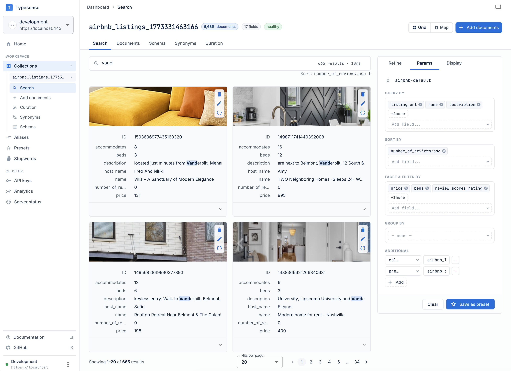
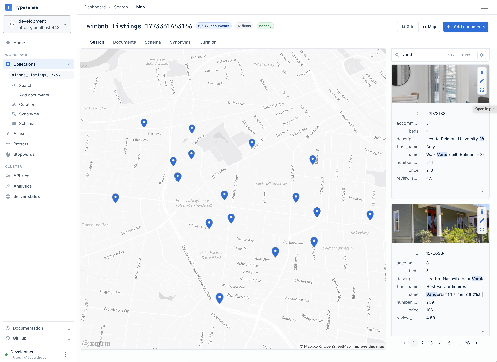
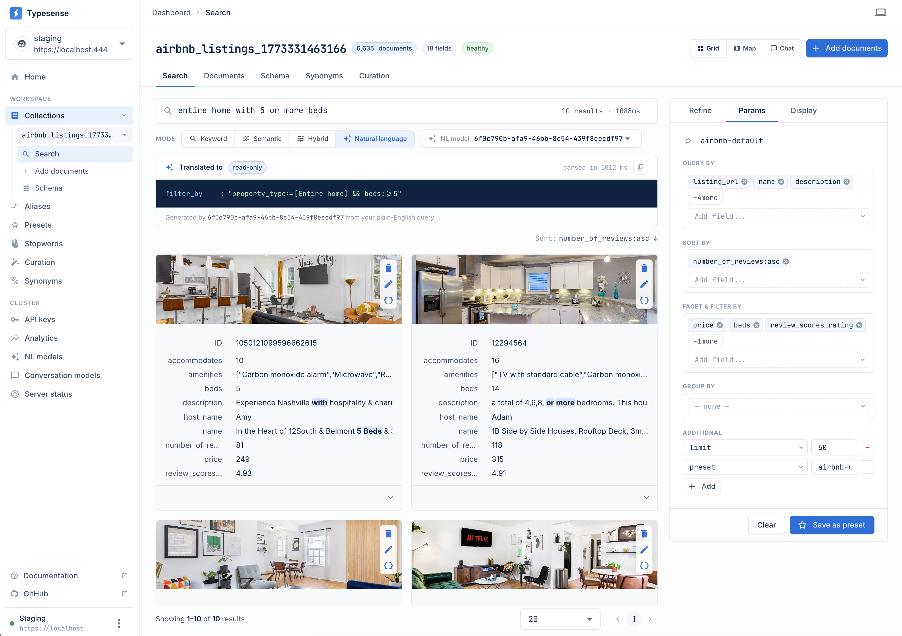
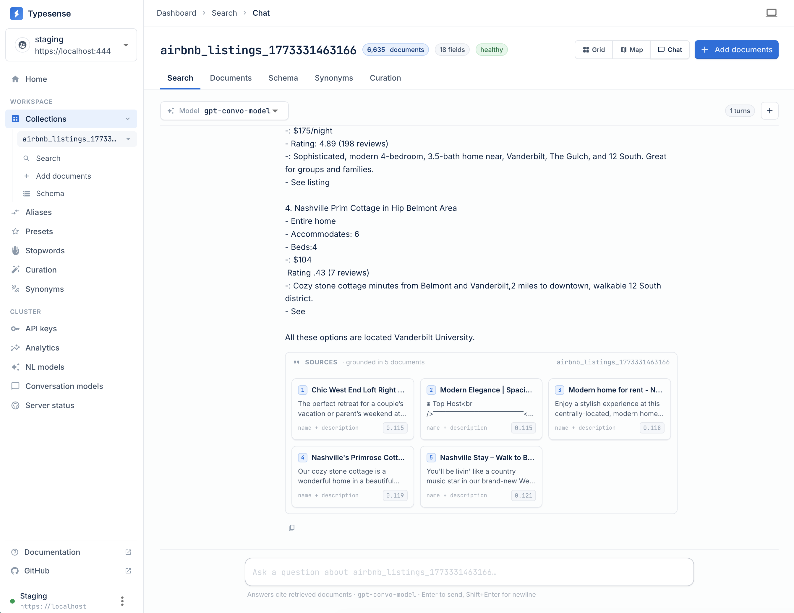
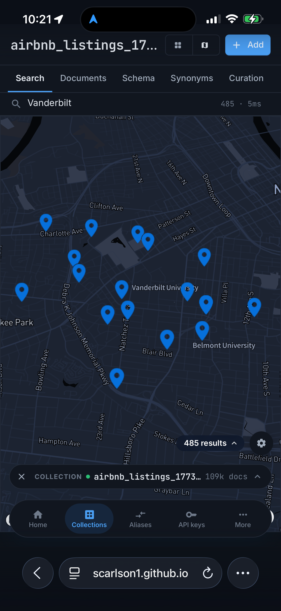
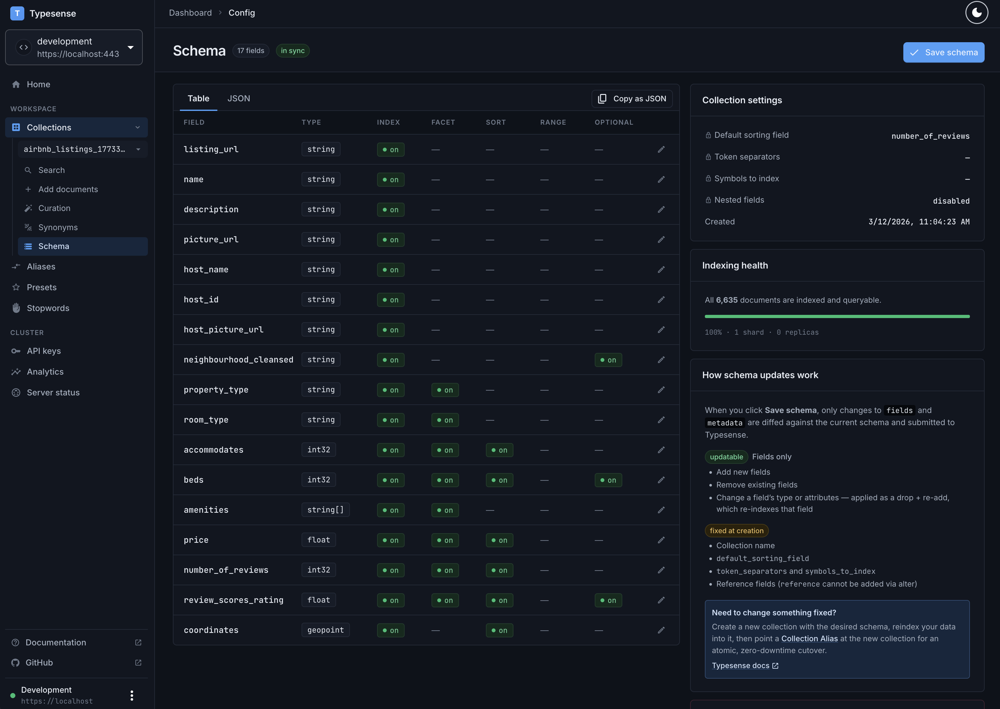
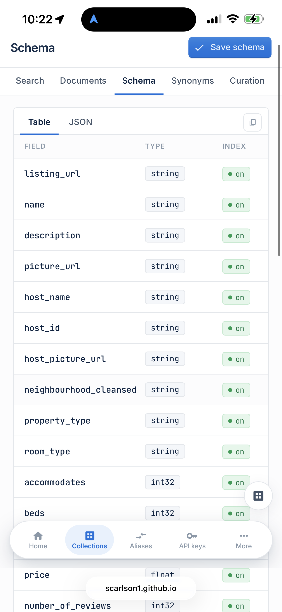
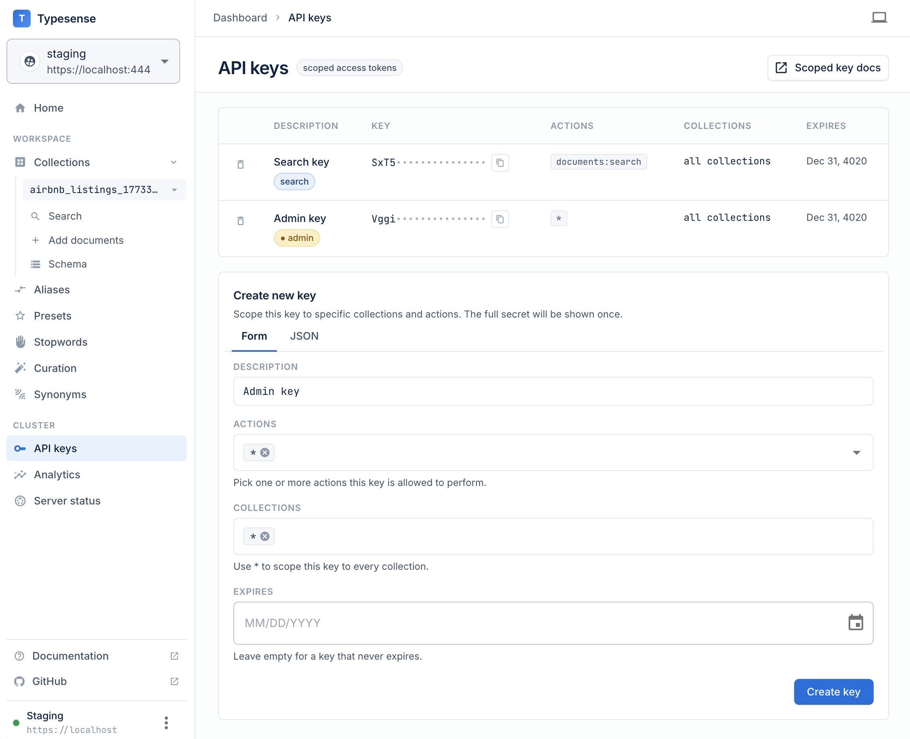
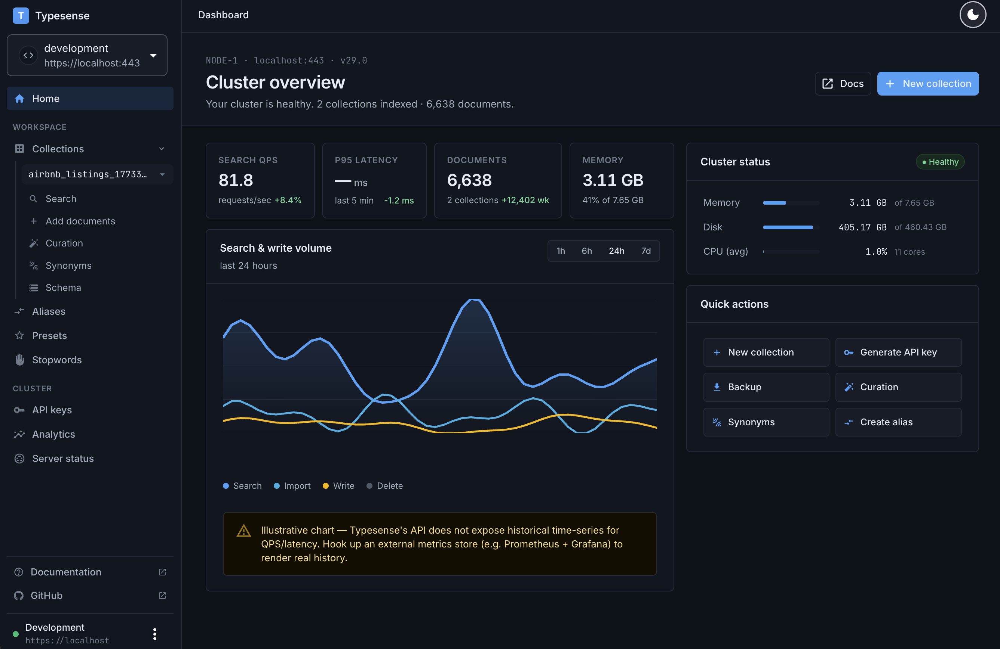
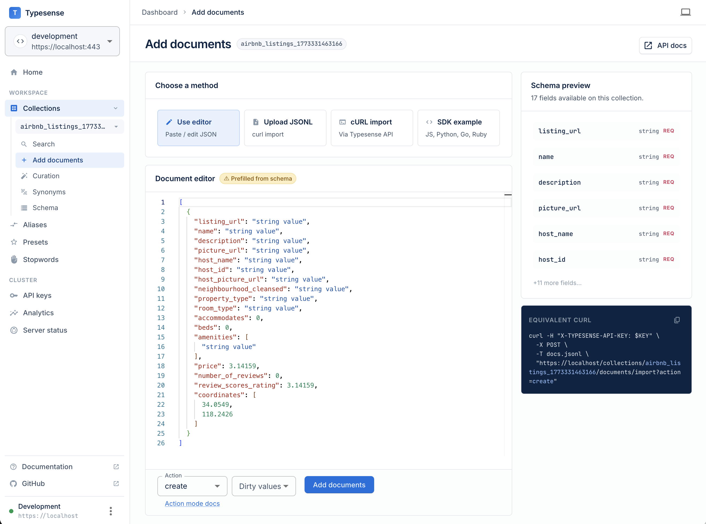

# Typesense Dashboard

A dashboard to manage self hosted or local [Typesense](https://typesense.org/) instances.

Reference the [Typesense docs](https://typesense.org/docs/guide/install-typesense.html) to set up a new cluster.

[View with demo data](https://scarlson1.github.io/typesense-dashboard/#/auth?node=163.192.220.255.nip.io&port=443&protocol=https&apiKey=q0DAf2GWCdw0LPCzM72UytDVh719h4Tk&env=development)

If the link is not prefilling login creds, use the following:

- dashboard: [https://scarlson1.github.io/typesense-dashboard](https://scarlson1.github.io/typesense-dashboard/#/auth)
- host: 163.192.220.255.nip.io
- protocol: https
- port: 443
- api key: q0DAf2GWCdw0LPCzM72UytDVh719h4Tk

## Deploy

The dashboard is a 100% client-side static SPA (no backend) — enter
Typesense host/key at runtime and the browser talks to Typesense directly.

Below are quick deployment options if you'd like to host the app instead of using the Github pages link above.

### Static hosting (dashboard only)

Deploy to any static host. Routing is hash-based, so **no SPA-fallback redirect
rules are needed**. Build with `pnpm build`, publish the `dist/` folder, and
optionally set `VITE_APP_VERSION` as a build-time env var. Geosearch is enabled
by entering a Mapbox token in the app (see below); `VITE_MAPBOX_TOKEN` can also
be baked in at build time as a default for self-hosted builds.

[](https://app.netlify.com/start/deploy?repository=https://github.com/scarlson1/typesense-dashboard)
[](https://vercel.com/new/clone?repository-url=https://github.com/scarlson1/typesense-dashboard)

- **Cloudflare Pages / Vercel / Netlify** — free, auto-HTTPS, custom domains.
  Vercel (`vercel.json`) and Netlify (`netlify.toml`) configs are included; on
  Cloudflare Pages set the build command to `pnpm build` and the output
  directory to `dist`.
- Just like GitHub Pages, a static dashboard served over **HTTPS can only reach
  Typesense over HTTPS** (mixed-content). If your Typesense is HTTP-only, use the
  Railway option below, or add TLS (see [Web](#web)).

### One-click on Railway (Typesense + dashboard)

[](https://railway.com/deploy)

WIP: template not set up yet.

Provisions a Typesense server (with auto-HTTPS) **and** the dashboard together,
so the dashboard reaches Typesense over HTTPS with no mixed-content errors and no
ngrok/self-signed-cert setup. See [docs/railway-template.md](docs/railway-template.md)
for the template definition. (Replace the button link with your published
template URL.)

### Desktop app (Electron)

**WIP: need to implement code signing**

The dashboard also packages as a native desktop app. The big win over the
browser build: the Electron renderer talks **directly to any Typesense node over
plain HTTP** — no TLS, no `--enable-cors`, no `nip.io`/ngrok — because the main
process injects permissive CORS headers for outbound requests (see
[electron/main.ts](electron/main.ts)). `webSecurity` stays enabled.

**Download:** grab the installer for your OS from the
[latest release](https://github.com/scarlson1/typesense-dashboard/releases/latest)
— `.dmg` (macOS), `.exe` (Windows), or `.AppImage` (Linux). Builds are not yet
code-signed, so macOS shows a Gatekeeper prompt (right-click → Open, or
System Settings → Privacy & Security → Open Anyway) and Windows shows a
SmartScreen warning (More info → Run anyway).

**Build from source:**

```bash
pnpm electron:dev          # run in development (Vite HMR + Electron)
pnpm electron:build        # build the three targets into out/
pnpm electron:pack         # build + produce an installer for the current OS
pnpm electron:pack:mac     # or :win / :linux for a specific target
```

Installers land in `release/`. `VITE_APP_VERSION` is baked in at build time
just like the web build; geosearch is enabled per-user by entering a Mapbox
token in-app (released installers ship without a baked token). App icons are
auto-detected from [build/](build/); code-signing/notarization need certs to
avoid Gatekeeper/SmartScreen warnings on distribution. The
[Build Electron installers](.github/workflows/electron-release.yaml) workflow
produces artifacts for macOS/Windows/Linux on tag push or manual dispatch.

## Supported Versions

Intended to be compatible with Typesense `v29` and `v30`.

## Usage

#### Prerequisites

- running instance of typesense ([docs](https://typesense.org/docs/guide/install-typesense.html#option-1-typesense-cloud))

### Web

Use https://scarlson1.github.io/typesense-dashboard/ or clone the repository and run it locally. (If using github pages option, Typesense config must be configured with TLS or you'll get "ERR_NETWORK Network Error").

- [Typesense Docs](https://typesense.org/docs/29.0/api/server-configuration.html#ssl-https)
<!-- - Self-signed certificate references: [video](https://www.youtube.com/watch?v=sR4_YISXNZE) / [article](https://deliciousbrains.com/ssl-certificate-authority-for-local-https-development/) / [mkcert](https://github.com/FiloSottile/mkcert) -->

If your typesense instance is running locally, use a service such as [ngrok](https://ngrok.com/) or [tailscale](https://tailscale.com/) to add TLS if connecting to [github pages](https://scarlson1.github.io/typesense-dashboard/). For example:

```bash
$ ngrok http https://localhost:443
  # OR use ngrok's docker image:
$ docker run -it -e NGROK_AUTHTOKEN=[YOUR_NGROK_TOKEN] ngrok/ngrok:latest http host.docker.internal:443
```

Then use the address displayed in your console under "Forwarding" as the node when connecting your cluster (ex: f4ab4aad2e7b.ngrok-free.app). [Ngrok docs](https://ngrok.com/docs/using-ngrok-with/docker/)

If using the Github pages option, pass the `--enable-cors` flag in typesense command.

Use an admin key to authenticate. Cluster credentials are stored in session storage and will be removed when the window is closed.

### Docker

Clone repo, build & run locally in Docker Desktop:

```bash
$ git clone git@github.com:scarlson1/typesense-dashboard.git
$ docker build -t typesense-dashboard .
$ docker run -d -p 8108:8108 typesense-dashboard
```

Pull image from Docker registry & run in Docker Desktop:

```bash
$ docker pull spencercarlson/typesense-dashboard
$ docker run -d -p 8108:8108 spencercarlson/typesense-dashboard
```

From Github Registry:

```bash
$ docker run -d -p 443:443 docker pull ghcr.io/scarlson1/typesense-dashboard:latest
```

To enable geosearch, open the **Map** view in the dashboard and paste a
[Mapbox access token](https://account.mapbox.com/access-tokens/). The token is
stored locally in your browser only. (Operators building their own image can
instead bake a default token in at build time with
`--build-arg VITE_MAPBOX_TOKEN="your_mapbox_token"`.)

## Screenshots









<!--  -->




<!--  -->








<!-- 


 -->

# Alternatives

- [Typesense Cloud](https://cloud.typesense.org/) (paid - official typesense commercial option)
- [Typelens](https://typelens.copperline.io/)
- [Typesense Desktop Client](https://www.typesense.app/)
- bfritscher/typesense-dashboard [github](https://github.com/bfritscher/typesense-dashboard/tree/main) (vue)
- amartya-dev/typesense-dashboard [github](https://github.com/amartya-dev/typesense-dashboard) (typescript)

## Development

### Run locally

#### Install dependencies

```bash
pnpm install
```

#### Start the dashboard

```bash
pnpm dev
```

### Docker Compose

Update the volume paths in `compose.yml` or update `TYPESENSE_CERTS_DIR` and `TYPESENSE_DATA_PATH` environment variable in `.env.development`. These map to certificate directory (for TLS) and the typesense data directory where typesense will persist data, respectively.

```yml
volumes:
  - [path_to_typesense_data]:/data
  - [path_to_your_certs_directory]:/etc/ssl/certs
```

```bash
docker compose up -d
```

## VM to host demo Typesense instance

### 1. Create the VM

```bash
cd terraform
# Step 1 - create reserved IP and instance, no attachment
terraform apply -var="attach_reserved_ip=false"

# Get the IP and update terraform.tfvars
terraform output reserved_ip
# set public_ip = "<output>" in terraform.tfvars

# Step 2 - attach reserved IP to instance
terraform apply -var="attach_reserved_ip=true"
```

`cloud-init.yaml`:

- installs typesense and start it as a systemd service
- configures iptables
- configures certificates and cron for auto-renewal

### Connect to typesense

nip.io is used for TLS. The address to access the VM is: `https://<your-ip>.nip.io`

Connect using:

- **Host:** `<your-ip>.nip.io`
- **Port:** `443`
- **Protocol:** `https`
- **API Key:** your Typesense API key (from `terraform.tfvars`)

## Set up demo data

Find a dataset. Checkout [Typesense's example datasets](https://github.com/typesense/typesense?tab=readme-ov-file)

Demo uses [Airbnb data](https://insideairbnb.com/get-the-data/)

> Import script creates an alias and points `airbnb_listings` to the newly imported data upon completion (effectively overwrites; doesn't append)

```bash
# download data
# regions
npx ts-node downloadData.ts --list-regions
npx ts-node scripts/downloadData.ts --dry-run --regions "united-states" --file-types "listings.csv.gz"
npx ts-node scripts/downloadData.ts --regions "united-states" --file-types "listings.csv.gz"
# cities
npx ts-node downloadData.ts --cities "amsterdam,london,new-york-city" --file-types "listings.csv.gz"

# transform data
npx ts-node scripts/transformData.ts

# index/import into typesense
export TYPESENSE_HOST=<typesense-host>
export TYPESENSE_PORT=443
export TYPESENSE_PROTOCOL=https
export TYPESENSE_ADMIN_API_KEY=xyz123
npx ts-node scripts/indexData.ts
```

### Troubleshooting

Troubleshooting demo data vm.

```bash
sudo systemctl status typesense-server

sudo iptables -L INPUT -n | head -20
sudo ss -tlnp | grep typesense

sudo cat /etc/typesense/typesense-server.ini
sudo systemctl cat typesense-server

# typesense install runs as root --> create typesense user
sudo systemctl restart typesense-server
sudo journalctl -u typesense-server -f &
sleep 3
sudo ss -tlnp | grep typesense-serve

# force recreate
terraform taint oci_core_instance.typesense
terraform apply -var="attach_reserved_ip=true"

# reset ssh
ssh-keygen -R 163.192.220.255
```

## Disclosure

This is an independent project. It's not associated with [typesense.org](https://typesense.org/) etc. etc.

## TODO

- add tests to CI
- [Filter operators](https://typesense.org/docs/guide/tips-for-filtering.html#available-operators)
- [Boolean operators](https://typesense.org/docs/guide/tips-for-filtering.html#boolean-operations)
- [Geo operators](https://typesense.org/docs/guide/tips-for-filtering.html#filtering-geopoints)
- [Geosearch filter & sort](https://typesense.org/docs/29.0/api/geosearch.html#searching-within-a-radius)
- Delete documents by query
- Export documents
- Map zoom to bounds on load
- theme matching toasts
- use version from context for docs links ??
- refactor conversational search to be a third option alongside grid & map views
- create collection missing `embed.from` ?? [docs](https://typesense.org/docs/30.2/api/vector-search.html#creating-an-auto-embedding-field)

```typescript
{
  "name": "embedding",
  "type": "float[]",
  "embed": {
    "from": [
      "product_name",
      "categories"
    ],
    "model_config": {
      "model_name": "ts/e5-small"
    }
  }
}
```

- **Vector / semantic search** — no UI to define embedding fields or issue `vector_query`/
  semantic search (v30).
- **Natural Language Search (`nl_search`) + NL search models** — key-actions exist
  (`typesenseApiKeyActions.ts`) but no routes/components to manage NL models or run NL queries.
- **Conversational Search / RAG + conversation models** — same: actions defined, no UI.
- **Document edit/view + partial update + update-by-query** —
  `documents/$documentId.tsx` is a "TODO: view not set up yet" stub; `useUpdateDocument.ts` exists
  but isn't wired into the UI; no PATCH-by-filter.
- **Federated multi-search** — no cross-collection multi-search UI.
