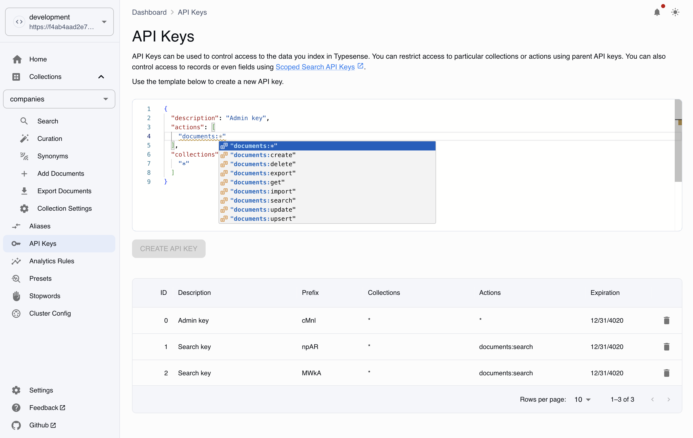

# Typesense Dashboard

A dashboard to manage self hosted or local [Typesense](https://typesense.org/) instances.

Reference the [Typesense docs](https://typesense.org/docs/guide/install-typesense.html) to set up a new cluster.

## Usage

### Web

As a web application, only typesense server started with `--enable-cors` will work.

Use an admin key to authenticate. Cluster credentials are stored in session storage and will be removed when the window is closed.

Use https://scarlson1.github.io/typesense-dashboard/ or clone the repository and run it locally. (Typesense config must be configured with SSL or you'll get "ERR_NETWORK Network Error"). [Typesense Docs](https://typesense.org/docs/29.0/api/server-configuration.html#ssl-https). Self-signed certificate reference: [video](https://www.youtube.com/watch?v=sR4_YISXNZE) / [article](https://deliciousbrains.com/ssl-certificate-authority-for-local-https-development/)

You can use a service such as [ngrok](https://ngrok.com/) or [tailscale](https://tailscale.com/) if connecting to [github pages](https://scarlson1.github.io/typesense-dashboard/). For example:

```bash
ngrok http https://localhost:443
# OR use ngrok's docker image:
docker run -it -e NGROK_AUTHTOKEN=[YOUR_NGROK_TOKEN] ngrok/ngrok:latest http host.docker.internal:443
```

Then use the address displayed in your console under "Forwarding" as the node when connecting your cluster (ex: f4ab4aad2e7b.ngrok-free.app). [Ngrok docs](https://ngrok.com/docs/using-ngrok-with/docker/)

### Docker

Download the repo and self-host with docker.

Example usage:

```bash
$ git clone git@github.com:scarlson1/typesense-dashboard.git
$ docker build -t typesense-dashboard .
$ docker run -d -p 8108:8108 typesense-dashboard
```

<!-- To use the latest pre-built image:

```bash
docker pull spencercarlson/typesense-dashboard
# or
docker run -d -p 443:443 spencercarlson/typesense-dashboard
```

To use the latest pre-built docker image:
```bash
docker run -d -p 443:443 ghcr.io/scarlson1/typesense-dashboard:latest
```

```bash
docker run -d -p 80:80 ghcr.io/scarlson1/typesense-dashboard:latest
```

If you have trouble connecting, trying ngrok.
option 1) ngrok http https://localhost:443
option 2) https://ngrok.com/docs/using-ngrok-with/docker/
-->

## Limitations/Issues

TODO

## TODO

- Tests
- [Filter operators](https://typesense.org/docs/guide/tips-for-filtering.html#available-operators)
- Facet/filter components ([range](https://typesense.org/docs/29.0/api/search.html#facet-ranges), numeric, etc.) currently only rendering checkmark
- [Boolean operators](https://typesense.org/docs/guide/tips-for-filtering.html#boolean-operations)
- [Geo operators](https://typesense.org/docs/guide/tips-for-filtering.html#filtering-geopoints)
- [Geosearch filter & sort](https://typesense.org/docs/29.0/api/geosearch.html#searching-within-a-radius)
- Search results view customization
- Improve search implementation
- Delete documents by query
- Export documents

## Screenshots




# Alternatives

- [Typesense Cloud](https://cloud.typesense.org/)(paid)
- bfritscher/typesense-dashboard([github])(https://github.com/bfritscher/typesense-dashboard/tree/main) (vue)
- amartya-dev/typesense-dashboard([github])(https://github.com/amartya-dev/typesense-dashboard) (typescript)

# Development

#### Install dependencies

```bash
npm install
```

#### run locally

```bash
npm run dev
```
